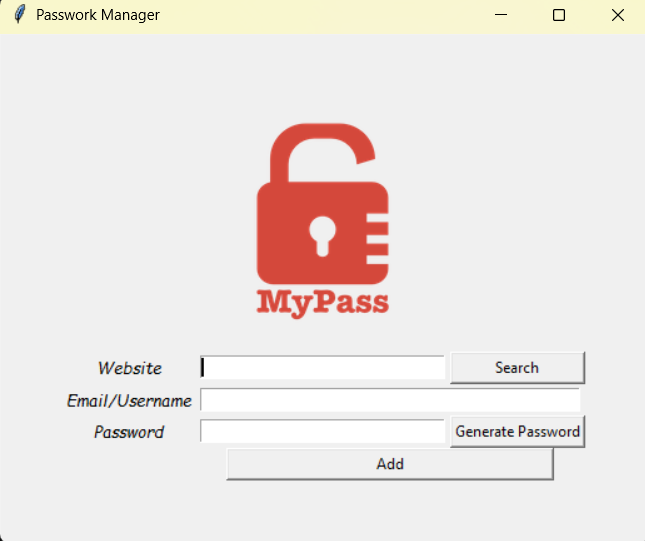

# 🔑 Password Manager  

## 📌 Overview  
This is a simple GUI-based Password Manager built with Python and Tkinter. It allows users to generate strong passwords, store them securely in a JSON file, and retrieve saved credentials with a search feature.  

## 🖼 Screenshot  
  

## 🚀 Features  
- **Generate Random Passwords** with letters, numbers, and symbols  
- **Save Credentials** securely in a `data.json` file  
- **Search for Saved Passwords** by website name  
- **User-Friendly Interface** using Tkinter  

## 🛠 Installation  

1. Clone this repository:  
   ```bash
   git clone <repo-url>
   cd <repo-folder>
